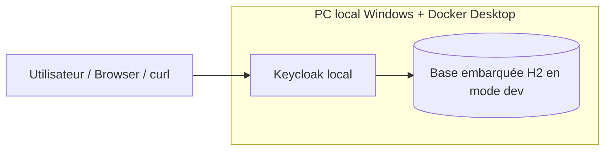
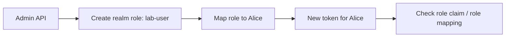

# Keycloak — Canvas complet de l’étape pratique actuelle

## 1. Objectif de cette étape

Construire un **premier lab Keycloak local minimal** sur le poste Windows / Git Bash, puis valider de bout en bout :
- les prérequis poste,
- le démarrage de Keycloak en local,
- l’accès console et OIDC,
- l’obtention d’un token admin,
- la création d’un realm de lab,
- la création d’un utilisateur,
- l’authentification de cet utilisateur,
- l’entrée dans la logique d’autorisation via les rôles.

---

## 2. Contexte poste

### Poste utilisateur
- OS : **Windows 11 23H2**
- Shell : **Git Bash / MINGW64**
- Répertoire de travail dépôt :
  `/c/workspaces/ExpertKeycloak/keycloak-enterprise-roadmap-v7`
- Répertoire de lab courant :
  `/c/workspaces/ExpertKeycloak/keycloak-enterprise-roadmap-v7/labs-local/01-keycloak-minimal`

### Outils validés
- Docker Desktop : **OK**
- Docker Engine : **OK**
- Docker Compose : **OK**
- Git : **OK**
- curl : **OK**
- jq : **OK**
- Java 17 : **OK**
- Maven : **OK**
- OpenSSL : **OK**
- kind : **OK**
- kubectl : **OK**
- helm : **OK**
- oc : **OK**
- Python : **non disponible pour l’instant**, non bloquant pour ce lab

---

## 3. Décision prise pendant le préflight

Un ancien cluster `kind` nommé `kc-kind` existait mais était **cassé / injoignable**. Il a été supprimé pour repartir proprement.

### Résultat
- plus de cluster `kind` actif pour cette phase,
- aucun contexte Kubernetes actif bloquant,
- démarrage du lab en **Docker local simple**, sans Kubernetes à ce stade.

---

## 4. Architecture de l’étape actuelle



### Lecture
- on démarre **Keycloak seul**,
- en **mode développement**,
- sans PostgreSQL externe,
- pour valider d’abord les briques IAM de base.

---

## 5. Fichier de lab créé

### `docker-compose.yml`

```yaml
services:
  keycloak:
    image: quay.io/keycloak/keycloak:26.2.5
    container_name: kc-lab-minimal
    command:
      - start-dev
      - --http-port=8080
    environment:
      KEYCLOAK_ADMIN: admin
      KEYCLOAK_ADMIN_PASSWORD: adminadmin
    ports:
      - "18080:8080"
    restart: unless-stopped
```

### Remarque
Les variables `KEYCLOAK_ADMIN` et `KEYCLOAK_ADMIN_PASSWORD` ont généré un warning de dépréciation, mais elles restent acceptables pour ce **premier lab minimal**.

---

## 6. Résultats validés jusqu’ici

## 6.1 Démarrage de Keycloak

### Commandes utilisées
```bash
docker compose up -d
docker compose ps
docker logs --tail 100 kc-lab-minimal
```

### Résultat
- conteneur `kc-lab-minimal` démarré,
- port exposé : **18080**,
- Keycloak démarré avec succès,
- écoute sur `http://0.0.0.0:8080` dans le conteneur,
- accessible localement via `http://localhost:18080`.

---

## 6.2 Validation HTTP et OIDC du realm `master`

### Commandes utilisées
```bash
curl -I http://localhost:18080
curl -I http://localhost:18080/admin/
curl -s http://localhost:18080/realms/master/.well-known/openid-configuration | jq -r '.issuer, .authorization_endpoint, .token_endpoint'
```

### Résultats
- `http://localhost:18080` répond,
- `/admin/` redirige correctement,
- découverte OIDC fonctionnelle pour le realm `master`.

### Endpoints validés
- issuer : `http://localhost:18080/realms/master`
- authorization endpoint : `http://localhost:18080/realms/master/protocol/openid-connect/auth`
- token endpoint : `http://localhost:18080/realms/master/protocol/openid-connect/token`

---

## 6.3 Obtention d’un token admin

### Commande utilisée
```bash
curl -s -X POST "http://localhost:18080/realms/master/protocol/openid-connect/token" \
  -H "Content-Type: application/x-www-form-urlencoded" \
  --data-urlencode "client_id=admin-cli" \
  --data-urlencode "username=admin" \
  --data-urlencode "password=adminadmin" \
  --data-urlencode "grant_type=password" \
  > admin-token.json
```

### Vérification
```bash
jq -r 'if .access_token then "TOKEN_OK" else "TOKEN_NOK" end' admin-token.json
jq -r '.token_type, .expires_in' admin-token.json
```

### Résultat
- `TOKEN_OK`
- `Bearer`
- durée de vie : **60 secondes** environ

### Point important
Le `401 Unauthorized` rencontré plus tard sur l’Admin API venait de là : **token trop court / expiré**.

---

## 6.4 Création du realm `lab`

### Fichier créé
`realm-lab.json`

```json
{
  "realm": "lab",
  "enabled": true,
  "displayName": "Lab Realm"
}
```

### Appel effectué
```bash
curl -s -o create-realm.out -w "%{http_code}\n" \
  -X POST "http://localhost:18080/admin/realms" \
  -H "Authorization: Bearer $ACCESS_TOKEN" \
  -H "Content-Type: application/json" \
  --data @realm-lab.json
```

### Résultat final validé
- code retour : **201**
- lecture ensuite via Admin API :
  - `lab`
  - `true`
  - `Lab Realm`

---

## 6.5 Création de l’utilisateur `alice`

### Fichier créé
`user-alice.json`

```json
{
  "username": "alice",
  "enabled": true,
  "firstName": "Alice",
  "lastName": "Lab",
  "email": "alice.lab@example.local",
  "emailVerified": true
}
```

### Appel effectué
```bash
curl -s -o create-user.out -w "%{http_code}\n" \
  -X POST "http://localhost:18080/admin/realms/lab/users" \
  -H "Authorization: Bearer $ACCESS_TOKEN" \
  -H "Content-Type: application/json" \
  --data @user-alice.json
```

### Résultat
- code retour : **201**
- utilisateur visible ensuite dans le realm `lab`

---

## 6.6 Définition du mot de passe d’Alice

### Étapes
1. récupération de l’ID interne d’Alice,
2. appel `reset-password` via Admin API.

### Commandes utilisées
```bash
ALICE_ID=$(curl -s "http://localhost:18080/admin/realms/lab/users?username=alice" \
  -H "Authorization: Bearer $ACCESS_TOKEN" | jq -r '.[0].id')

curl -s -o set-password.out -w "%{http_code}\n" \
  -X PUT "http://localhost:18080/admin/realms/lab/users/$ALICE_ID/reset-password" \
  -H "Authorization: Bearer $ACCESS_TOKEN" \
  -H "Content-Type: application/json" \
  --data '{"type":"password","temporary":false,"value":"alice123!"}'
```

### Résultat
- ID utilisateur récupéré,
- code retour sur reset password : **204**.

---

## 6.7 Authentification réelle d’Alice

### Commande utilisée
```bash
curl -s -X POST "http://localhost:18080/realms/lab/protocol/openid-connect/token" \
  -H "Content-Type: application/x-www-form-urlencoded" \
  --data-urlencode "client_id=admin-cli" \
  --data-urlencode "username=alice" \
  --data-urlencode "password=alice123!" \
  --data-urlencode "grant_type=password" \
  > alice-token.json
```

### Vérification
```bash
jq -r 'if .access_token then "ALICE_TOKEN_OK" else "ALICE_TOKEN_NOK" end' alice-token.json
jq -r '.token_type, .expires_in' alice-token.json
```

### Résultat
- `ALICE_TOKEN_OK`
- `Bearer`
- expiration : **300 secondes**

### Conclusion
L’utilisateur `alice` peut **réellement s’authentifier** dans le realm `lab`.

---

## 7. Problèmes rencontrés et corrections

## 7.1 Problème initial Docker
### Symptôme
`docker version` ne joignait pas le moteur Linux Docker Desktop.

### Cause probable
Docker Desktop pas encore démarré ou pas prêt.

### Résolution
Relancer / attendre Docker Desktop puis refaire le test.

---

## 7.2 Cluster `kind` cassé
### Symptôme
API server `127.0.0.1:49805` refusé.

### Décision
Suppression du cluster `kc-kind` pour repartir proprement.

---

## 7.3 `401 Unauthorized` sur l’Admin API
### Cause
Token `admin-cli` expiré trop vite.

### Résolution
Toujours régénérer un token admin juste avant l’appel sensible.

---

## 7.4 Décodage JWT incomplet sous Git Bash
### Symptôme
certains claims du token sortaient à `null` malgré un token valide.

### Conclusion
Le souci vient du décodage shell local, pas de Keycloak.

### Décision pragmatique
Ne pas bloquer le lab là-dessus ; continuer avec les preuves IAM plus utiles :
- token obtenu,
- realm créé,
- user créé,
- login fonctionnel.

---

## 8. État actuel exact du lab

### Ce qui est déjà fait
- prérequis poste vérifiés,
- Docker Desktop validé,
- Keycloak minimal lancé,
- console et OIDC validés,
- token admin obtenu,
- realm `lab` créé,
- utilisateur `alice` créé,
- mot de passe défini,
- login d’Alice validé.

### Ce qui est en cours de préparation
- **autorisation** : création d’un rôle realm,
- attribution du rôle à Alice,
- puis vérification dans les rôles / dans le token.

---

## 9. Étape suivante immédiate

### But
Créer un rôle realm `lab-user` et l’assigner à Alice.

### Flux attendu


### Ce qu’on validera ensuite
- création du rôle,
- mapping du rôle à Alice,
- lecture des rôles d’Alice,
- puis, plus tard : groupes, clients, client roles, scopes, mappers.

---

## 10. Résumé pédagogique de la progression

### Ce que cette étape t’a déjà appris
- comment vérifier proprement un poste de lab,
- comment démarrer Keycloak localement,
- comment obtenir un token admin,
- comment utiliser l’Admin API,
- comment créer un realm,
- comment créer un utilisateur,
- comment définir un mot de passe,
- comment tester une authentification réelle.

### Différence lab vs production
#### Dans ce lab
- mode `start-dev`
- base H2 embarquée
- HTTP simple
- secrets en clair
- realm `master` utilisé pour l’admin bootstrap

#### En production
- PostgreSQL ou autre base supportée
- HTTPS / proxy / hostname / certificats
- secrets gérés correctement
- observabilité, sauvegarde, runbooks
- haute disponibilité / cluster / gouvernance IAM

---

## 11. Checklist de validation de l’étape

- [x] Docker Desktop OK
- [x] Docker Engine OK
- [x] Git Bash OK
- [x] Keycloak local lancé
- [x] endpoint `/admin/` OK
- [x] OIDC discovery OK
- [x] token admin OK
- [x] realm `lab` créé
- [x] user `alice` créé
- [x] mot de passe `alice` défini
- [x] login `alice` validé
- [ ] rôle realm créé
- [ ] rôle attribué à Alice
- [ ] vérification fine de l’autorisation

---

## 12. Commandes clés à retenir de cette étape

### Démarrage du lab
```bash
docker compose up -d
docker compose ps
docker logs --tail 100 kc-lab-minimal
```

### Token admin
```bash
curl -s -X POST "http://localhost:18080/realms/master/protocol/openid-connect/token" \
  -H "Content-Type: application/x-www-form-urlencoded" \
  --data-urlencode "client_id=admin-cli" \
  --data-urlencode "username=admin" \
  --data-urlencode "password=adminadmin" \
  --data-urlencode "grant_type=password" \
  > admin-token.json
```

### Création du realm
```bash
curl -s -o create-realm.out -w "%{http_code}\n" \
  -X POST "http://localhost:18080/admin/realms" \
  -H "Authorization: Bearer $ACCESS_TOKEN" \
  -H "Content-Type: application/json" \
  --data @realm-lab.json
```

### Création du user
```bash
curl -s -o create-user.out -w "%{http_code}\n" \
  -X POST "http://localhost:18080/admin/realms/lab/users" \
  -H "Authorization: Bearer $ACCESS_TOKEN" \
  -H "Content-Type: application/json" \
  --data @user-alice.json
```

### Reset mot de passe
```bash
curl -s -o set-password.out -w "%{http_code}\n" \
  -X PUT "http://localhost:18080/admin/realms/lab/users/$ALICE_ID/reset-password" \
  -H "Authorization: Bearer $ACCESS_TOKEN" \
  -H "Content-Type: application/json" \
  --data '{"type":"password","temporary":false,"value":"alice123!"}'
```

### Login utilisateur
```bash
curl -s -X POST "http://localhost:18080/realms/lab/protocol/openid-connect/token" \
  -H "Content-Type: application/x-www-form-urlencoded" \
  --data-urlencode "client_id=admin-cli" \
  --data-urlencode "username=alice" \
  --data-urlencode "password=alice123!" \
  --data-urlencode "grant_type=password" \
  > alice-token.json
```

---

## 13. Suite recommandée

Ordre logique recommandé après cette étape :
1. créer un **realm role**,
2. attribuer le rôle à Alice,
3. créer un **client OIDC dédié**,
4. tester un vrai login utilisateur sur ce client,
5. explorer **groups / client roles / scopes / protocol mappers**,
6. passer ensuite à PostgreSQL, reverse proxy et sécurité avancée.

