# Roadmap complète — Keycloak vers OpenShift expert

## 1. Vue d’ensemble

Cette roadmap organise le parcours complet depuis le **lab Keycloak local minimal** jusqu’à un niveau **expert Keycloak + Kubernetes + OpenShift + exploitation + architecture**.

Elle distingue trois niveaux de lecture :
- **macro** : grandes phases,
- **méso** : objectifs majeurs par phase,
- **micro** : pas interactifs réels à exécuter sur le poste.

---

## 2. Estimation globale

### Nombre de phases
**9 phases**

### Nombre d’objectifs majeurs
**environ 53 objectifs**

### Nombre de micro-étapes interactives réelles
**entre 120 et 180 micro-étapes**

> Pourquoi une fourchette ?
Parce que certaines phases peuvent être courtes ou longues selon :
- les erreurs rencontrées,
- les reprises après incident,
- le temps passé sur les variantes,
- le niveau de profondeur visé,
- le fait qu’on documente aussi architecture + runbooks + HLD/LLD.

---

## 3. Découpage global par phase

| Phase | Intitulé | Objectifs majeurs estimés | Micro-étapes estimées | Statut |
|---|---|---:|---:|---|
| 1 | Realm role initial et attribution | 4 | 6 à 10 | À faire maintenant |
| 2 | IAM de base | 7 | 12 à 20 | En cours |
| 3 | Clients et OIDC | 8 | 15 à 25 | À faire |
| 4 | Scopes et mappers | 5 | 10 à 15 | À faire |
| 5 | Sécurité avancée | 9 | 20 à 30 | À faire |
| 6 | Observabilité et exploitation | 6 | 10 à 18 | À faire |
| 7 | PostgreSQL et externalisation | 4 | 8 à 12 | À faire |
| 8 | Kubernetes local | 5 | 15 à 22 | À faire |
| 9 | OpenShift niveau expert | 5 | 24 à 28 | À faire |

### Total
- **53 objectifs majeurs**
- **120 à 180 micro-étapes**

---

## 4. Lecture par phase

## Phase 1 — Realm role initial et attribution
### But
Commencer la partie autorisation avec un premier rôle métier simple.

### Objectifs
1. créer le rôle realm `lab-user`
2. lire le rôle
3. attribuer le rôle à `alice`
4. vérifier le mapping

### Estimation
- **4 objectifs**
- **6 à 10 micro-étapes**

### Résultat attendu
Alice porte un rôle realm lisible via Admin API, puis plus tard visible dans son token ou ses permissions.

---

## Phase 2 — IAM de base
### But
Maîtriser les briques fondamentales d’identité et d’autorisation.

### Objectifs
1. realm roles
2. groups
3. role mappings
4. users / groups / roles design
5. client roles
6. lecture des affectations
7. mini-modèle d’autorisation propre

### Estimation
- **7 objectifs**
- **12 à 20 micro-étapes**

### Résultat attendu
Savoir modéliser un petit domaine IAM propre dans un realm Keycloak.

---

## Phase 3 — Clients et OIDC
### But
Passer de l’admin API à de vrais clients OIDC.

### Objectifs
1. créer un client OIDC dédié
2. configurer un client public / confidentiel
3. tester Authorization Code Flow
4. tester Client Credentials
5. tester Refresh Token
6. tester Introspection
7. tester Logout
8. tester JWKS

### Estimation
- **8 objectifs**
- **15 à 25 micro-étapes**

### Résultat attendu
Comprendre Keycloak comme fournisseur OIDC complet, pas seulement comme console admin.

---

## Phase 4 — Scopes et mappers
### But
Maîtriser le contenu des tokens et la projection des claims.

### Objectifs
1. client scopes
2. protocol mappers
3. claims custom
4. contrôle du contenu access token / ID token
5. lecture propre des tokens

### Estimation
- **5 objectifs**
- **10 à 15 micro-étapes**

### Résultat attendu
Savoir expliquer et piloter ce qui entre dans les tokens.

---

## Phase 5 — Sécurité avancée
### But
Monter sur les sujets différenciants de niveau expert.

### Objectifs
1. hostname
2. reverse proxy
3. TLS
4. passkeys / WebAuthn
5. token exchange
6. client policies
7. secret rotation
8. service accounts
9. truststores / confiance sortante

### Estimation
- **9 objectifs**
- **20 à 30 micro-étapes**

### Résultat attendu
Savoir sécuriser Keycloak correctement et comprendre les compromis de prod.

---

## Phase 6 — Observabilité et exploitation
### But
Passer d’un lab fonctionnel à un service opérable.

### Objectifs
1. health
2. metrics
3. management interface
4. logs
5. premiers runbooks
6. incidents courants / diagnostic

### Estimation
- **6 objectifs**
- **10 à 18 micro-étapes**

### Résultat attendu
Savoir surveiller, diagnostiquer et exploiter Keycloak comme un service critique.

---

## Phase 7 — PostgreSQL et externalisation
### But
Sortir du mode dev H2 et approcher un design plus réaliste.

### Objectifs
1. ajouter PostgreSQL
2. connecter Keycloak à PostgreSQL
3. vérifier schéma / persistance
4. valider redémarrage et stabilité

### Estimation
- **4 objectifs**
- **8 à 12 micro-étapes**

### Résultat attendu
Disposer d’un lab plus proche de la production sur la couche base de données.

---

## Phase 8 — Kubernetes local
### But
Faire la transition du conteneur seul vers une plateforme Kubernetes locale.

### Objectifs
1. recréer un cluster kind propre
2. déployer Keycloak sur Kubernetes
3. exposer le service / ingress
4. gérer secrets / probes / manifests
5. ajouter monitoring minimal

### Estimation
- **5 objectifs**
- **15 à 22 micro-étapes**

### Résultat attendu
Savoir faire tourner Keycloak sur Kubernetes local avec des manifests lisibles.

---

## Phase 9 — OpenShift niveau expert
### But
Passer du Kubernetes local à une lecture experte OpenShift.

### Objectifs
1. traduire les patterns K8s vers OpenShift
2. raisonner Route / Ingress / Operator / SCC / Projects / RBAC
3. déployer Keycloak avec une logique compatible OpenShift
4. utiliser l’Operator Keycloak
5. intégrer la démarche GitOps / HLD / LLD / runbooks

### Estimation
- **5 objectifs**
- **24 à 28 micro-étapes**

### Résultat attendu
Atteindre un niveau d’architecte / expert ops capable de raisonner Keycloak sur OpenShift de manière crédible.

---

## 5. Ce qui est déjà fait

## Préflight poste
Validé :
- Git Bash
- Docker Desktop
- Docker Engine
- Docker Compose
- Git
- curl
- jq
- Java 17
- Maven
- OpenSSL
- kind
- kubectl
- helm
- oc
- WSL2

## Lab local minimal
Validé :
- démarrage de Keycloak local
- accès HTTP
- console admin
- discovery OIDC du realm `master`
- token admin obtenu
- realm `lab` créé
- utilisateur `alice` créé
- mot de passe défini
- authentification réelle d’Alice validée

### Estimation de progression déjà accomplie
En micro-étapes réelles, environ **30 à 40 micro-étapes** ont déjà été faites.

---

## 6. Ce qu’il reste à faire

### Immédiatement
- créer le rôle realm `lab-user`
- l’attribuer à `alice`
- vérifier le mapping de rôle

### Ensuite
- groups
- client roles
- clients OIDC
- scopes et mappers
- sécurité avancée
- observabilité
- PostgreSQL
- Kubernetes local
- OpenShift expert

### Estimation restante
Il reste environ **90 à 140 micro-étapes** selon le niveau de détail conservé.

---

## 7. Répartition de difficulté

### Phases les plus rapides
- Phase 1 — realm role initial
- début de la phase 2 — IAM de base

### Phases intermédiaires
- Phase 3 — clients et OIDC
- Phase 4 — scopes et mappers
- Phase 7 — PostgreSQL

### Phases les plus longues et les plus riches
- Phase 5 — sécurité avancée
- Phase 8 — Kubernetes local
- Phase 9 — OpenShift niveau expert

---

## 8. Vue synthétique d’avancement

```mermaid
flowchart LR
    P0[Préflight] --> P1[Lab local minimal]
    P1 --> P2[Realm role initial]
    P2 --> P3[IAM de base]
    P3 --> P4[Clients OIDC]
    P4 --> P5[Scopes & Mappers]
    P5 --> P6[Sécurité avancée]
    P6 --> P7[Observabilité]
    P7 --> P8[PostgreSQL]
    P8 --> P9[Kubernetes local]
    P9 --> P10[OpenShift expert]
```

### État
- **Préflight** : terminé
- **Lab local minimal** : terminé
- **Realm role initial** : prochain point immédiat
- **Tout le reste** : à dérouler progressivement

---

## 9. Vue en pourcentage approximatif

### Si on raisonne en micro-étapes
- déjà fait : **20 à 30 %**
- restant : **70 à 80 %**

### Pourquoi ce n’est pas plus ?
Parce que le plus lourd reste à faire :
- sécurité avancée,
- exploitation,
- PostgreSQL,
- Kubernetes,
- OpenShift expert.

---

## 10. Utilisation de ce canvas

Ce canvas sert à :
- visualiser l’ensemble de la trajectoire,
- savoir où on en est,
- reprendre proprement dans une nouvelle session,
- piloter l’avancement phase par phase,
- estimer la charge restante.

---

## 11. Reprise recommandée

### Point exact de reprise
**Phase 1 — créer le rôle realm `lab-user` et l’attribuer à `alice`**

### Principe
- une seule micro-étape à la fois,
- validation stricte,
- historique complet des commandes,
- progression continue vers Keycloak expert puis OpenShift expert.

